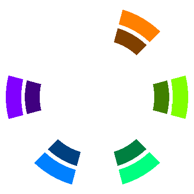
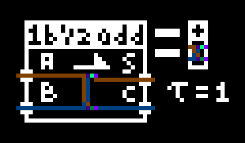
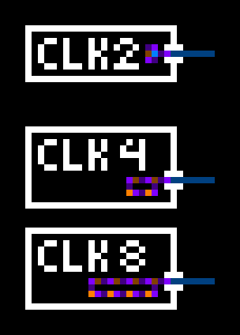

# Reso is a circuit design language and simulator where the inputs and outputs are bitmap images


Reso is a pet project of mine that I've been working on in my free time for a little while. This logo is actually an animation of the execution of a Reso circuit.

* For the math nerds: Reso is a circuit design language and simulator that allows you to define an undirected boolean computational graph by connecting contiguous regions of colored elements in a 2D map.

* For the engineering nerds: Reso is a useless, slow, minimal-feature digital logic simulator where you build wires and gates out of pixels! Its only redeeming qualities are that it's fun, pretty, and maybe a fun project to reimpliment in Rust.


Reso is inspired by:

 * Minecraft's Redstone
 * The Piet esoteric language
 * The many hours I spent debugging my awful Redstone circuit.
 * Python and C.
 
Reso is inspired by Python in the sense that, just as Python is akin to "executable pseudocode", Reso was inspired by wishing I could execute bitmap-images that made my Redstone circuit.

Reso was inspired by C in the sense that C is simple enough that one can understand it *entirely*. It's a small enough language to hold every feature and the standard libraries in your head. I wanted Reso to be the same in that regard.

Now, before I write more of this blog post, don't let me fool you! Reso isn't good. I never intended for it to be good, actually, and things don't need to be good. Reso is bad because:

 * It's inaccessible to those who are blind
 * It's inaccessible to those who are colorblind
 * It's inaccessible to those who have full color vision, because I foolishly chose colors for elements that are way too similar on most monitors. (Lime and teal).
 * It's very slow, because I prioritized code quality and readability over speed
 * It's very slow, because I used Python
 * The code quality and readability is poor
 * It is not interactive, unlike actually useful digital logic design software.
 
Ew, right?! This means that Reso is software made *entirely for fun!* And it isn't even a video game!

With that out of the way, I'm happy you're still reading this blog post! Now that you have a good idea of why Reso is bad, let's get into how to actually use it.

# Reso circuits 101

I'll assume you -- the reader -- is already familiar with digital logic circuits. That is, you should be comfortable with:

1. What 'True' and 'False' means.
2. What `AND`, `XOR`, `OR`, and `NOT` gates are.
3. The fact that you can build a computer from these if you put your mind to it!!

With that out of the way, let's get started!

## Reso's 10-color palette


Reso circuits are defined by contiguous regions of pixels (called Resels).

While we define 24 colors as "reserved", in practice, there are 10 colors that we use in Reso:


| Color          | Meaning               | Hex code       |
| ---            | ---                   | ---            |
| Bright orange  | Orange wire (on)      | ```#ff8000```  |
| Dark  orange   | Orange wire (off)     | ```#804000```  |
| Bright sapphire| Sapphire wire (on)    | ```#0080ff```  |
| Dark sapphire  | Sapphire wire (off)   | ```#004080```  |
| Bright lime    | Lime wire (on)        | ```#80ff00```  |
| Dark lime      | Lime wire (off)       | ```#408000```  |
| Bright purple  | Output (node to wire) | ```#8000ff```  |
| Dark purple    | Input (wire to node)  | ```#400080```  |
| Bright teal    | XOR logic node        | ```#00ff80```  |
| Dark teal      | AND logic node        | ```#008040```  |

Here is what the limited 10-color palette looks like:



Six of these colors (three hues, orange, sapphire, and lime, across two tones, dark and bright) are dedicated to wires, which hold on or off states.

Two colors (dark and bright teal) are dedicated to logical-AND and logical-XOR. 

It'd be nice if we could just connect a wire blob to, say, a logical-XOR blob, but then we'd lack directionality! How would we tell input from output wires? Reso circuits are defined by adjacencies of pixel blobs, and that is inherently undirected.

So, to cheat,  we use purple to add input and output nodes for logic. This adds directionality as-needed. With that out of the way...

# Logic gates in Reso

... Let's discuss logic gates!

 implemented in Reso.")


This... This is pretty much it. Stare at it until it makes sense! These are the four basic logic gates, as implemented in Reso. (Note that the choice of wire color doesn't matter here.)

The magic of Reso is that you can copy-paste these all around. You can perform any lossless transformation on it. Flip it, rotate it (by 90 degrees, of course), anything that doesn't interpolate pixel colors or mess with contiguities of regions! This makes everything you make entirely modular.

Note that the black and white pixels are *outside* of the palette. They are semantically insignificant! You can use these colors like comments or for diagrams, like I do here! You can make your circuits sparse and readable, or you can tightly knit your gates together.

# Example: A one-bit adder.




Here is an example of a one-bit half adder in Reso. It is implemented in two ways: A "verbose" adder that labels inputs and outputs, and a "mini" adder that is better suited for more tightly-knit circuits.

Note that the blue and orange wires here cross over one another diagonally: A neat trick in Reso is that wires are the only elements for which contiguity is defined on the diagonals.

# Example: A digital clock




Clocks are rather easy to build for small periods. This is a small, 3-bit (8 value) counter, formed from three digital clocks. An edge-triggered flip-flop can be used to double the period of a clock , but I didn't do that here, because these are small and simple enough.

Note the timing of these things. We add an input/output pair at the edge to prevent someone from accidentally messing with the clock from setting the output wire "on". This causes a delay of one timestep, which is accounted for in the design of the clock. The minimum period for a clock is 2 timesteps (i.e. on for one timestep, off for one timestep.)

# The rest?

So, you can totally build a computer in this and all sorts of other wacky things! It is Turing Complete, after all. But this is an introductory blog post.

The repository is at [https://gitlab.com/lynnpepin/reso](https://gitlab.com/lynnpepin/reso). A GitHub mirror is at [https://github.com/lynnpepin/reso](https://github.com/lynnpepin/reso). Go check it out, run the code, and play around with it!

And if you make something neat, I'd love to know! :) This work is being presented at !!Con 2021, and I'll edit this with a link to the livestream recording once it's up.
